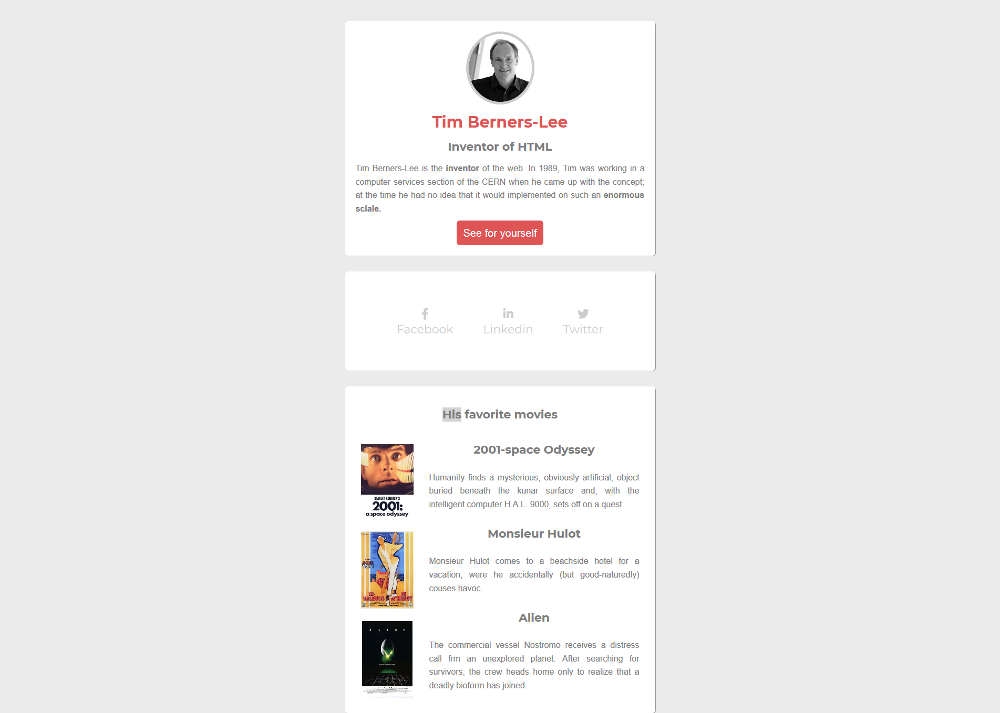

# Reproduction layout HTML, CSS

Autre exercice durant ma formation chez Becode, de reproduction d'un layout en **HTML** et **CSS**

résultat :

Lien de l'exercice [ici](https://github.com/becodeorg/CRL-Woods-2.15/blob/master/Parcours/01-Prairie/05.HTML-CSS/7-exercice-summary.md).